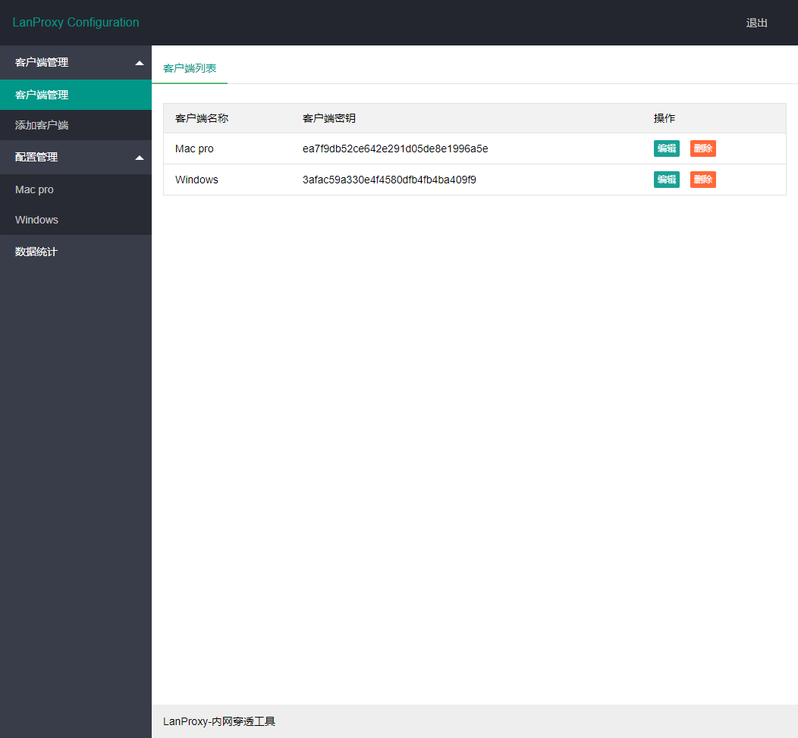
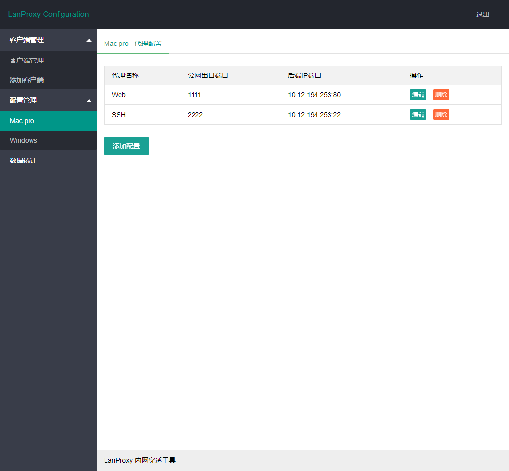
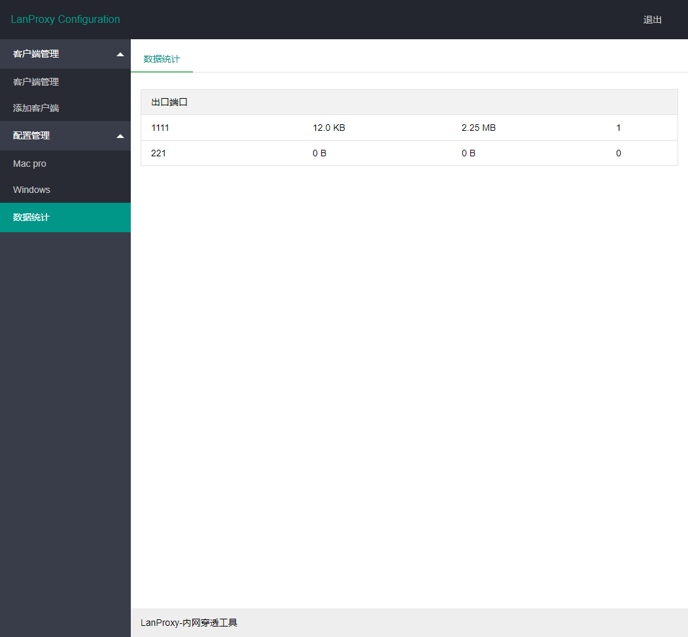

lanproxy
--------

[README](README_en.md) | [中文文档](README.md)

lanproxy是一个将局域网个人电脑、服务器代理到公网的内网穿透工具，目前仅支持tcp流量转发，可支持任何tcp上层协议（访问内网网站、本地支付接口调试、ssh访问、远程桌面...）。目前市面上提供类似服务的有花生壳、TeamView、GoToMyCloud等等，但要使用第三方的公网服务器就必须为第三方付费，并且这些服务都有各种各样的限制，此外，由于数据包会流经第三方，因此对数据安全也是一大隐患。

### 相关地址

- 主页 https://lanproxy.thingsglobal.org
- 发布包下载地址 https://github.com/ffay/lanproxy/releases

### 实现方案


### 使用

#### 编译生成运行包

-	拉取源码，运行 mvn package，打包后的资源放在distribution目录中，包括client和server

#### 配置

##### server配置

server的配置文件放置在conf目录中，配置 config.properties

```properties
server.bind=0.0.0.0

#与代理客户端通信端口
server.port=4900

#ssl相关配置
server.ssl.enable=true
server.ssl.bind=0.0.0.0
server.ssl.port=4993
server.ssl.jksPath=test.jks
server.ssl.keyStorePassword=123456
server.ssl.keyManagerPassword=123456
server.ssl.needsClientAuth=false

#WEB在线配置管理相关信息
config.server.bind=0.0.0.0
config.server.port=8090
config.admin.username=admin
config.admin.password=admin

```

代理配置，打开地址 http://ip:8090 ，使用上面配置中配置的用户名密码登录，进入如下代理配置界面







> 一个server可以支持多个客户端连接
> 配置数据存放在 ~/.lanproxy/config.json 文件中

##### client配置

client的配置文件放置在conf目录中，配置 config.properties

```properties

#与在proxy-server配置后台创建客户端时填写的秘钥保持一致；没有服务器可以登录 https://lanproxy.org/ 创建客户端获取秘钥
client.key=
ssl.enable=true
ssl.jksPath=test.jks
ssl.keyStorePassword=123456

#这里填写实际的proxy-server地址；没有服务器默认即可，自己有服务器的更换为自己的proxy-server（IP）地址
server.host=lp.thingsglobal.org

#proxy-server ssl默认端口4993，默认普通端口4900
#ssl.enable=true时这里填写ssl端口，ssl.enable=false时这里填写普通端口
server.port=4993

```

#### 运行

-	一台内网pc或服务器（运行proxy-client）；一台公网服务器（运行proxy-server）
-	安装java1.8运行环境
-	linux（mac）环境中运行bin目录下的 startup.sh
-	windows环境中运行bin目录下的 startup.bat

#### 其他

- 后面是将自己电脑从VPS代理出去测试的一个地址，大家可以访问试试 http://devbook.thingsglobal.org/
- 对于正常网站，80和443端口只有一个，可以和 https://github.com/ffay/proxygateway 这个项目或nginx配合使用，不同域名反向代理到内部其他端口上去，再由其他端口映射到内网即可；对于ssh或远程桌面等可随意选择其他未占用的端口映射到内网
