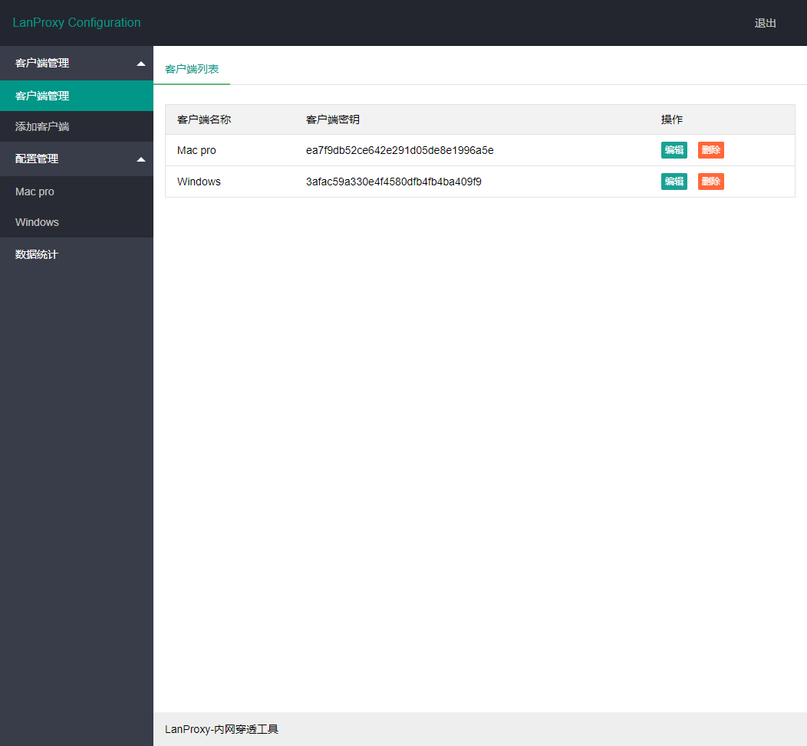
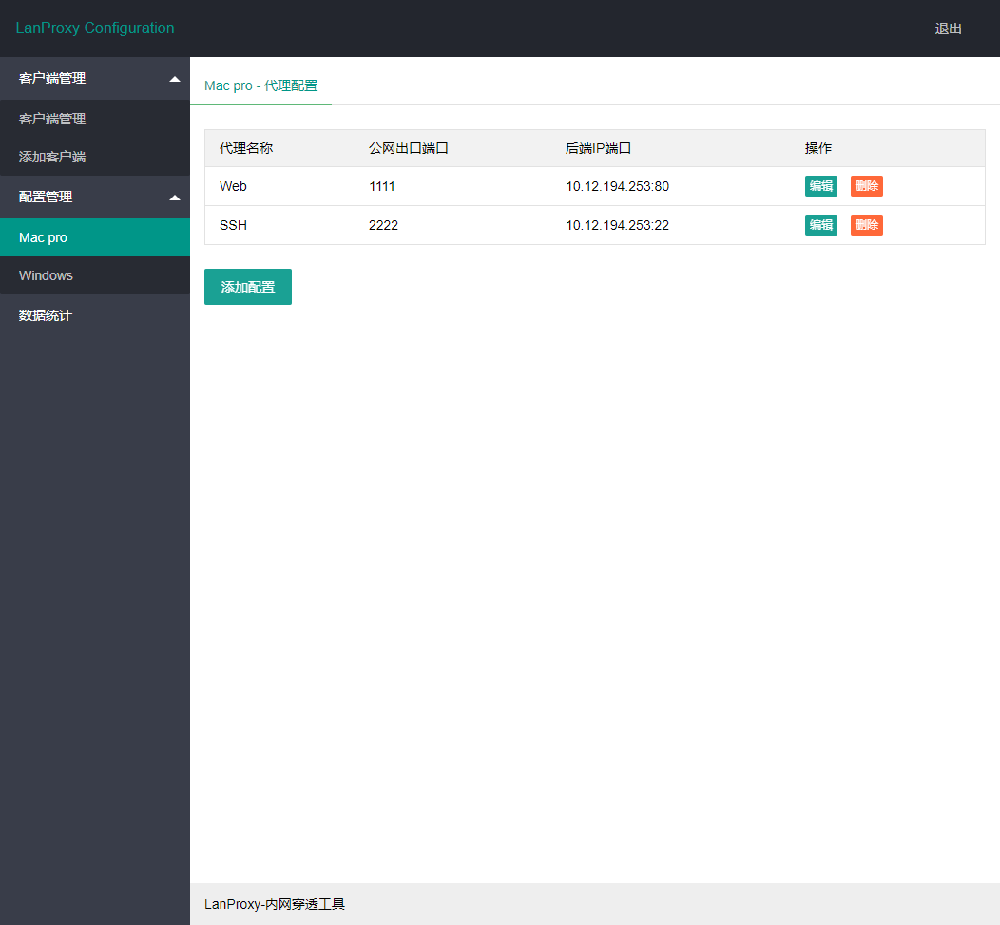
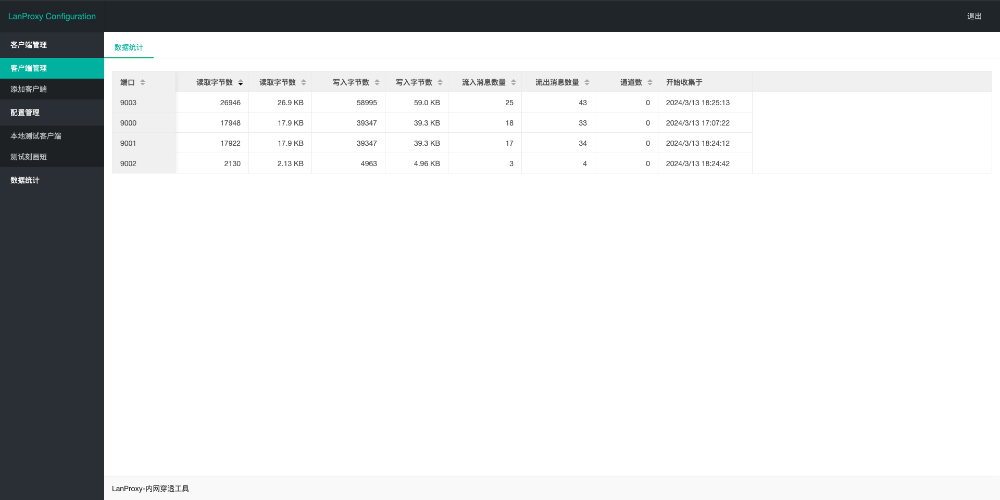
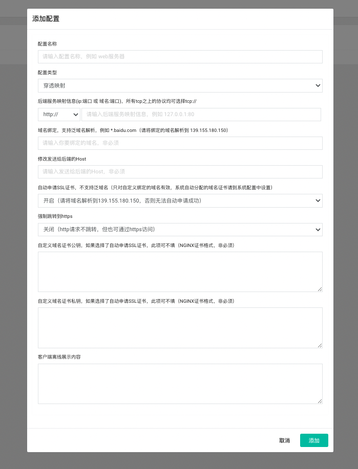
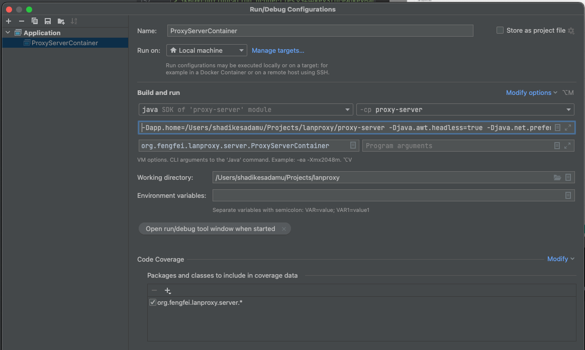

## 技术交流QQ群 736294209

## Lanproxy运营版上线，欢迎体验

https://nat.nioee.com

## Lanproxy个人升级版

核心功能：

- 穿透基础功能，同开源版本，高性能，可同时支持数万穿透连接
- 全新界面UI，操作简单，部署简单（java+mysql）
- 自定义域名绑定，为你穿透端口绑定域名，不再是IP+端口裸奔访问
- 自定义域名ssl证书，也可为你绑定的域名开启ssl证书自动申请与续期，无需人工干涉
- 自定义客户端离线展示页面，可以利用该功能展示一些html单页
- 支持http/https/socks5多种模式使用客户端网络代理上网，家里轻松访问公司网络
- 多用户支持，同时满足多人日常穿透需求

体验地址 https://lanp.nioee.com (测试用户名密码 test/123456)


## Lanproxy开源免费版

[README](README_en.md) | [中文文档](README.md)

lanproxy是一个将局域网个人电脑、服务器代理到公网的内网穿透工具，支持tcp流量转发，可支持任何tcp上层协议（访问内网网站、本地支付接口调试、ssh访问、远程桌面...）。目前市面上提供类似服务的有花生壳、TeamView、GoToMyCloud等等，但要使用第三方的公网服务器就必须为第三方付费，并且这些服务都有各种各样的限制，此外，由于数据包会流经第三方，因此对数据安全也是一大隐患。

### 相关地址

- 主页 https://nat.nioee.com
- lanproxy-go-client https://github.com/ffay/lanproxy-go-client
- 发布包下载地址 https://github.com/ffay/lanproxy/releases

### 使用

#### 获取发布包

- 拉取源码，运行 mvn package，打包后的资源放在distribution目录中，包括client和server
- 或直接下载发布包  https://github.com/ffay/lanproxy/releases

#### 配置

##### server配置

server的配置文件放置在conf目录中，配置 config.properties

```properties
server.bind=0.0.0.0
#与代理客户端通信端口
server.port=4900
#ssl相关配置
server.ssl.enable=true
server.ssl.bind=0.0.0.0
server.ssl.port=4993
server.ssl.jksPath=test.jks
server.ssl.keyStorePassword=123456
server.ssl.keyManagerPassword=123456
#这个配置可以忽略
server.ssl.needsClientAuth=false
#WEB在线配置管理相关信息
config.server.bind=0.0.0.0
config.server.port=8090
config.admin.username=admin
config.admin.password=admin
```

代理配置，打开地址 http://ip:8090 ，使用上面配置中配置的用户名密码登录，进入如下代理配置界面







> 一个server可以支持多个客户端连接
> 配置数据存放在 ~/.lanproxy/config.json 文件中

##### Java 客户端配置

> Java client的配置文件放置在conf目录中，配置 config.properties

```properties

#与在proxy-server配置后台创建客户端时填写的秘钥保持一致；
client.key=
ssl.enable=true
ssl.jksPath=test.jks
ssl.keyStorePassword=123456
#这里填写实际的proxy-server地址；没有服务器默认即可，自己有服务器的更换为自己的proxy-server（IP）地址
server.host=lp.thingsglobal.org
#proxy-server ssl默认端口4993，默认普通端口4900
#ssl.enable=true时这里填写ssl端口，ssl.enable=false时这里填写普通端口
server.port=4993
```

- 安装java1.7或以上环境
- linux（mac）环境中运行bin目录下的 startup.sh
- windows环境中运行bin目录下的 startup.bat

##### 其他平台客户端

> 不用java客户端的可以使用下面提供的各个平台的客户端，省去安装java运行环境

###### 源码地址

https://github.com/ffay/lanproxy-go-client

###### 发布包

https://github.com/ffay/lanproxy-go-client/releases

###### 普通端口连接

```shell
# mac 64位
nohup ./client_darwin_amd64 -s SERVER_IP -p SERVER_PORT -k CLIENT_KEY &

# linux 64位
nohup ./client_linux_amd64 -s SERVER_IP -p SERVER_PORT -k CLIENT_KEY &

# windows 64 位
./client_windows_amd64.exe -s SERVER_IP -p SERVER_PORT -k CLIENT_KEY
```

###### SSL端口连接

```shell
# mac 64位
nohup ./client_darwin_amd64 -s SERVER_IP -p SERVER_SSL_PORT -k CLIENT_KEY -ssl true &

# linux 64位
nohup ./client_linux_amd64 -s SERVER_IP -p SERVER_SSL_PORT -k CLIENT_KEY -ssl true &

# windows 64 位
./client_windows_amd64.exe -s SERVER_IP -p SERVER_SSL_PORT -k CLIENT_KEY -ssl true
```

#### 其他

- 在家里使用公司的网络，可以和 https://github.com/ffay/http-proxy-server
  这个http代理项目配合使用（个人升级版已经内置代理上网功能，详细资料 https://file.nioee.com/f/76ebbce67c864e4dbe7e/ ）
- 对于正常网站，80和443端口只有一个，可以购买个人升级版本解决端口复用问题

## 生成 JSK 文件

```shell
keytool -genkey -keyalg RSA -keysize 2048 -validity 365 -dname "CN=test, OU=test,O=test, L=shanghai, ST=shanghai, C=CN" -alias csii_key -keypass 888888 -keystore sdm-202212011626.jks -storepass 123456
```

### ⚠️注️：

> 1. 当-keypass 和 -storepass 设为不同时，keytool会给出以下警告：
> ```shell
> 警告: PKCS12 密钥库不支持其他存储和密钥口令。正在忽略用户指定的-keypass值。
> ```
> 这时在configuration.properties文件中keyStore和keyManager密码必须为一直是kesStore的密码。
> ```properties
> server.ssl.keyStorePassword=123456(keystore密码）
> server.ssl.keyManagerPassword=123456（keystore密码）
> ```
> 2.提高安全性： keysize必须为大于等于2048
> ```shell
> 生成的证书 使用的 1024 位 RSA 密钥 被视为存在安全风险。此密钥大小将在未来的更新中被禁用。
>```
> 详情请见 [“陷阱”素数（‘trapdoored’ primes）的出现，使用1024位密钥加密算法已不再安全](https://searchsecurity.techtarget.com.cn/11-24358/)

### 进阶版

#### 映射配置



### 开发&调试

如果想在IDEA中运行并调试，务必要配置Application Configuration

JVM Options:
```shell
-Dapp.home=<项目的绝对路径>/proxy-server
-Djava.awt.headless=true
-Djava.net.preferIPv4Stack=true
-Djdk.tls.rejectClientInitiatedRenegotiation=true
-Xdebug
-Xnoagent
-Djava.compiler=NONE
-Xrunjdwp:transport=dt_socket,address=12000,server=y,suspend=n
```