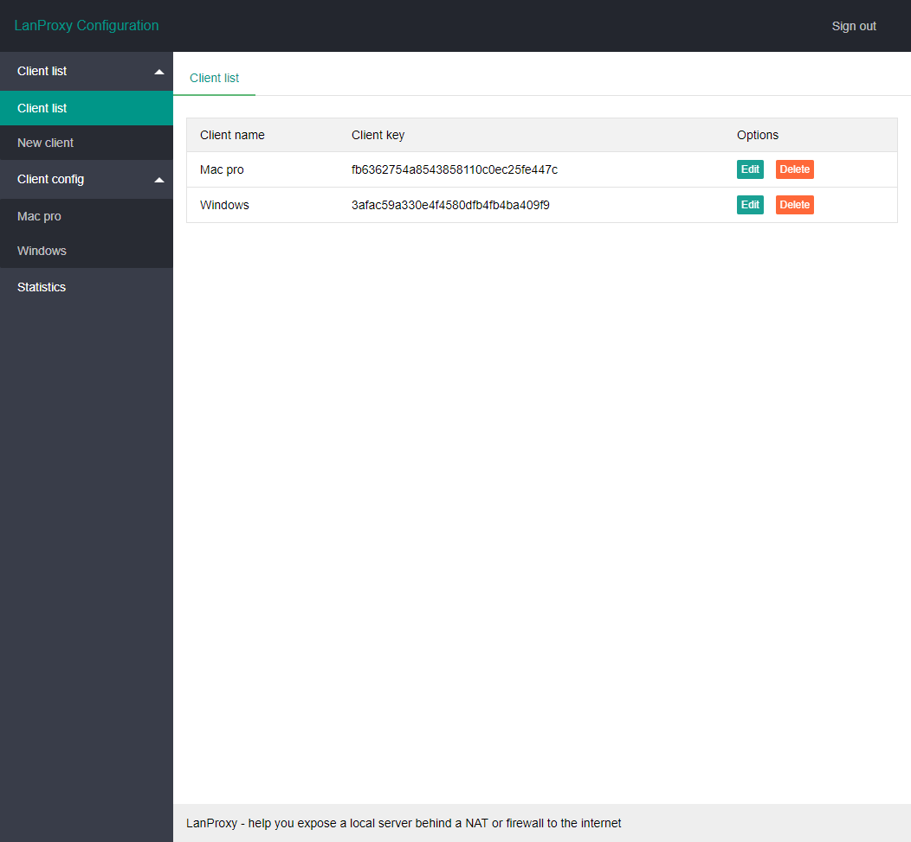
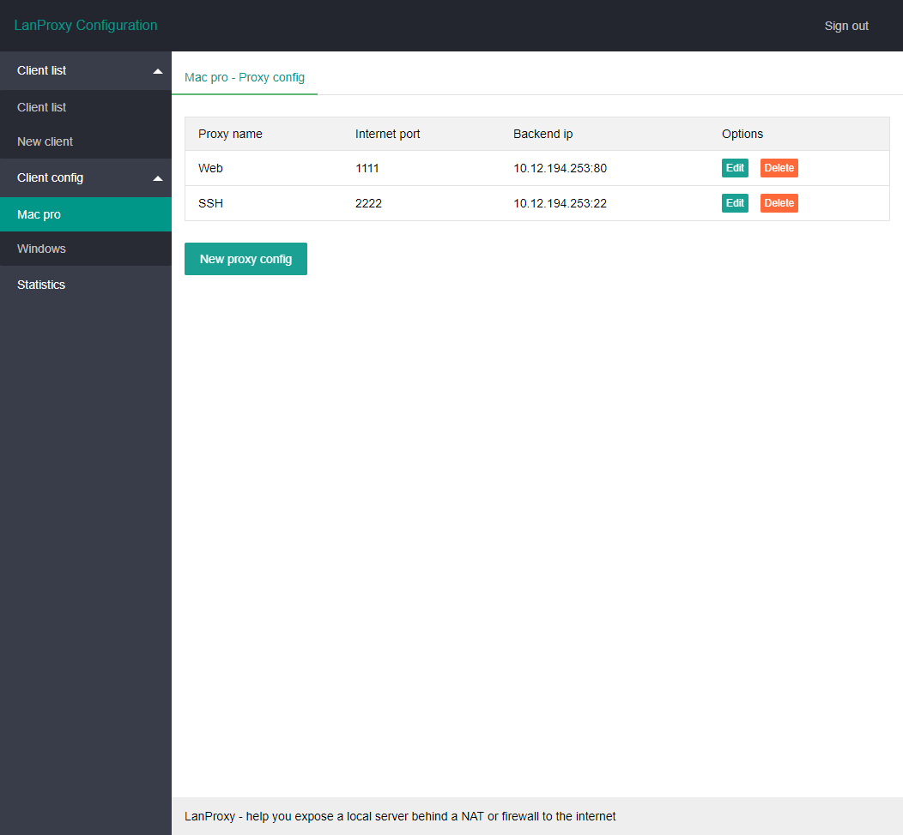
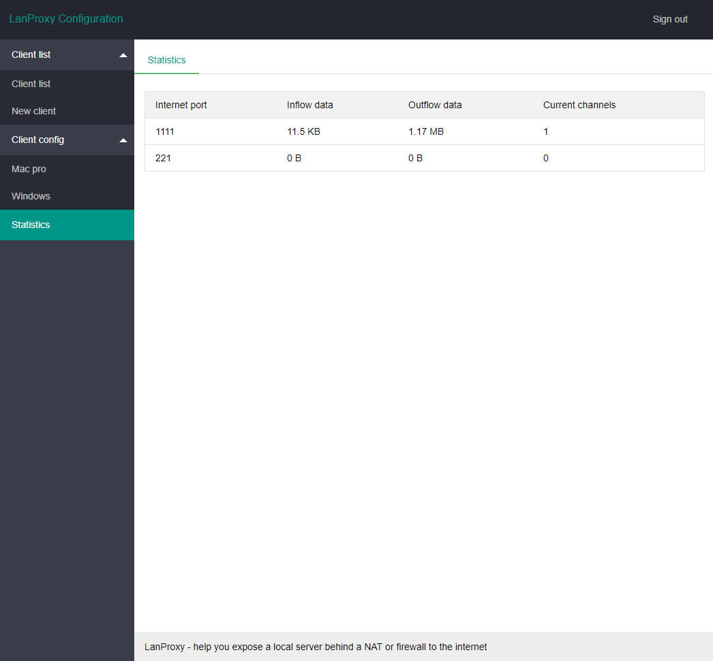

### Lanproxy

[README](README_en.md) | [中文文档](README.md)

Lanproxy is a reverse proxy to help you expose a local server behind a NAT or firewall to the internet. it supports any protocols over tcp (http https ssh ...)

### Features

- Secure tunnels to localhost
- Supports any protocols over tcp (http https ssh ...)
- Supports web config pages, easy to configure management
- Written by java netty framework, high performance

### What can I do with Lanproxy

- Demo without deploying
- Simplify mobile device testing
- Build webhook integrations with ease
- Run personal cloud services from your own private network

### Architecture


### Configure

#### Server

proxy-server config file is **conf/config.properties**

```properties
server.bind=0.0.0.0

#Plain tcp port
server.port=4900

#ssl
server.ssl.enable=true
server.ssl.bind=0.0.0.0
server.ssl.port=4993
server.ssl.jksPath=test.jks
server.ssl.keyStorePassword=123456
server.ssl.keyManagerPassword=123456
server.ssl.needsClientAuth=false

#web config pages
config.server.bind=0.0.0.0
config.server.port=8090
config.admin.username=admin
config.admin.password=admin

```

> Visit your config web service using url http://ip:8090







#### client

proxy-client config file is **conf/config.properties**

```properties
#get from proxy-server client list page
client.key=
ssl.enable=true
ssl.jksPath=test.jks
ssl.keyStorePassword=123456

#your proxy server ip
server.host=

#proxy-server ssl port is 4993，plain port is 4900
server.port=4993
```

### Run

- Get release package from https://github.com/ffay/lanproxy/releases
- Java env is required
- Linux（mac）run bin/startup.sh
- Windows run bin/startup.bat